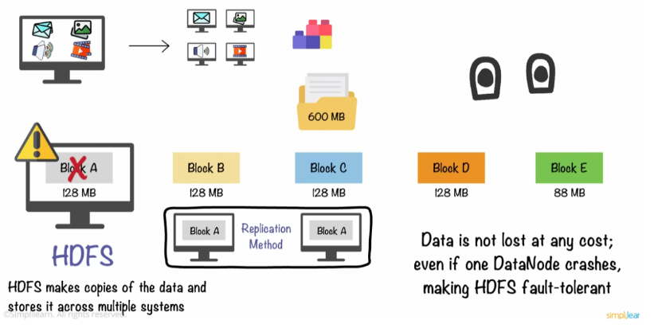

> '빅데이터를 지탱하는 기술' 도서스터디로 3장을 공부하며 정리한 내용이다.

1. **Hadoop**에서 구조화 데이터를 만들어서 집계할 때까지의 흐름과 **Spark**의 차이점에 대해 이해한다.
2. Hadoop 위에서 구조화 데이터를 집계하기 위한 **쿼리 엔진**에 대해 이해한다.

## **1. 대규모 분산 처리의 프레임워크**

- **구조화 데이터(Structured data)**: 스키마가 명확하게 정의된 데이터(테이블의 컬럼 명, 데이터형, 테이블 간의 관계를 정의해서 SQL로 집계가 가능함) → **기존의 데이터 웨어하우스에 축적** 
- **비구조화 데이터(Unstructured data)**: 스키마가 없는 데이터(자연 언어로 작성된 텍스트 데이터와 이미지, 동영상 등)
- **스키마리스 데이터(Schemaless data)**: 반구조화 데이터라고도 불리며 서식은 정해져 있지만, 칼럼 수나 데이터형은 명확하지 않은 데이터(JSON, CSV, XML 등)

→ 스키마가 없는 데이터는 데이터를 가공하는 과정에서 스키마를 정의하고 구조화된 데이터로 변환함으로써 다른 데이터와 마찬가지로 분석할 수 있음

### **Hadoop**

빅데이터를 대표하는 시스템 바로 Hadoop이다.

- Hadoop이란, **분산 시스템을 구성하는 다수의 소프트웨어로 이뤄진 집합체를 뜻한다.**
- Hadoop의 역사는 2003년 시작되었는데, 더그 커팅과 카페렐라가 웹 검색 엔진인 'Nutch' 프로젝트를 진행하며, 빠른 웹 성장에 대응하여 대용량의 비정형 데이터를 처리하기위한 더 효율적인 검색 엔진을 만들기 위한 대규모 데이터 처리 방법을 찾고 있었음.
- 이 과정에서 Google에서 발표한 논문 **① Google File System(GFS)**과 **② MapReduce**에서 영감을 받아 개발함.*GFS: 수십만대의 저렴한 컴퓨터 하드웨어로 구성된 대규모 클러스터 환경에서 높은 성능 제공. 대규모 데이터를 처리하기 위해 파일을 여러 블록으로 나누고, 각 블록을 클러스터의 여러 노드에 분산 저장. 장애에 대비하여 데이터 복제 기능을 제공.
- 2006년에는 Hadoop이라는 별도 프로젝트로 분리하여 오픈소스 Apache Hadoop으로 배포되었으며, 이름은 더그 커팅의 아들의 장난감 코끼리 인형 'Hadoop'에서 따와 지었다

→ 하둡은 하나의 성능 좋은 컴퓨터를 이용하여 데이터를 처리하는 대신,  **적당한 성능의 컴퓨터 여러 대를 클러스터화하고 분산 저장하여,**   **큰 크기의 데이터를 클러스터에서 병렬로 동시에 처리(분산 처리)하여 처리 속도를 높이는 것을 목적으로 하는 오픈소스 프레임워크**

### 주요 구성 요소

### 1. 분산 파일 시스템 - HDFS (Hadoop Distributed File System)

: 여러 대의 서버에 데이터를 분산시키고 , 각 서버에 저장된 데이터를 동시에 처리하는 방식

Hadoop에서 처리되는 데이터 대부분은 **분산 파일 시스템인 HDFS에 저장****큰 데이터 블록을 여러 데이터 노드에 분산시키는 방식**네트워크에 연결된 파일 서버이며, **다수 컴퓨터에 파일을 복사하여 중복성을 높임 →** 대용량 데이터를 안전하게 저장할 수 있도록 설계데이터를 빠르고 효율적으로 처리할 수 있음

### 2. 리소스 관리자 - YARN (Yet Another Resource Negotiator) 

: 클러스터의 리소스를 관리하고 애플리케이션의 스케줄링을 담당

**CPU나 메모리 등의 계산 리소스**는 매니저인 YARN에 의해 관리됨**컨테이너**라고 불리는 단위로 관리클러스터 전체의 부하를 보고 비어있는 호스트부터 **컨테이너**를 할당함

### 3. 분산 데이터 처리 - MapReduce

: 여러 대의 적당한 성능의 서버로 분산시켜 빠르게 데이터를 처리하는 방법

2004년 구글에서 발표데이터를 **'Map' 단계에서 처리**하고 그 결과를 **'Reduce' 단계에서 요약****Map:** **분산(Spliting)할 데이터를 Key, Value 쌍으로 분산 처리**해서 (ex. count 문제라면 Key가 몇 번 나왔는지 Value에 저장) 처리 & 리스트 생성**Reduce:** **각 분석된 데이터를 통합관리**(Shuffling 한 뒤 Reducing. Filtering과 Sorting으로 원하는 데이터 추출하고, 중복 데이터를 제거, Load balancing)이 과정을 통해 복잡하고 대용량의 데이터 집합을 분산시켜 처리할 수 있다.**비구조화 배치 데이터를 가공하는 데에 적합**하며 **자바** 기반 프레임워크**왜 배치 데이터 처리에서 적합할까?** 분산된 데이터를 한 번에 쭉 끌어 오기 때문이다. 그러면 작은 쿼리 반복 수행은, 시스템 처리에서 오버헤드가 크니까 다소 부적합하다. 

### Hive on MapReduce

- MapReduce를 자바 언어가 아닌 쿼리로 대량 데이터를 배치 처리

- Hive는 Facebook에서 개발되어, 현재는 Apache Software Foundation의 프로젝트 중 하나
- **+** **Hive는 자동으로 쿼리를 MapReduce 프로그램으로 변환하는 역할**을 하는데, 이는 **대량의 데이터를 배치 처리**하는데는 유용
- **+** 데이터 집계를 위해 SQL 등의 쿼리 언어를 사용할 경우, **SQL과 유사한 쿼리 언어인 HiveQL**을 제공 → SQL과 유사한 방식으로 하둡 데이터에 대해 질의&분석 가능
- **-** 작은 프로그램을 빠르게 실행하거나 여러번 실행되는 애드 혹 쿼리에는 부적합
- **-** 실시간 쿼리를 지원하지 않아 실시간 데이터 처리나 분석에는 적합하지 않음

Hive on MapReduce에서는 각 데이터 처리 스테이지 사이에 대기 시간이 있습니다. 이는 Hive가 MapReduce 작업을 사용하여 쿼리를 계산하고, 각 작업은 데이터를 디스크에 읽고 쓰는 과정을 포함하기 때문입니다.복잡한 쿼리의 경우, 여러 개의 MapReduce 작업이 연속적으로 실행되어야 합니다. 각 MapReduce 작업이 끝날 때마다 **중간 결과를 디스크에 기록하고,** 다음 작업이 이를 다시 읽어들여야 합니다. 이 과정에서 발생하는 디스크 I/O는 비효율적이며, 이로 인해 대기 시간이 늘어나게 됩니다.또한, 각 MapReduce 작업은 JVM(Java Virtual Machine)을 시작하는 과정을 포함하는데, 이 과정 또한 상당한 시간이 소요됩니다. 이러한 대기 시간은 쿼리의 전체 실행 시간을 증가시키는 주요 요인 중 하나입니다.이런 이유로 Hive on Tez 같은 다른 데이터 처리 프레임워크를 사용하는 것이 더 효율적일 수 있습니다.**Tez는 모든 데이터 처리 작업을 하나의 JVM에서 처리하며, 중간 결과를 메모리에 저장하여 디스크 I/O를 최소화합니다. 이로 인해 복잡한 쿼리에서도 대기 시간을 크게 줄일 수 있습니다.**

## 2. Spark

- 디스크 기반의 MapReduce를 대체하여 in-mememory 형의 고속 데이터 처리 프레임워크

- 2009년 UC 버클리의 AMPLab에서 클러스트 컴퓨팅에서 반복적인 알고리즘을 더 효율적으로 처리하기 위한 방법으로 Spark가 개발됨
- 2013년 Apache 재단에서 Hadoop과는 다른 독립된 프로젝트로 MapReduce보다 더 효율적인 데이터 처리를 실현하는 프로젝트로 승격

**in-memory 형의 고속 데이터 처리**

- MapReduce가 개발된 시절보다 메모리의 양이 증가하면서, **가능한 한 많은 데이터를 메모리상에 올린 상태**로 두어 디스크에는 아무것도 기록하지 않는 방법으로 개발
- 즉, **in-memory 처리 방식**을 채택함으로써 데이터를 RAM에 저장하고 처리하는 것으로 **디스크 기반의 MapReduce보다 빠른 분석 속도를 제공**

**다양한 스크립트 언어 및 실시간 처리 가능**

- Spark는 **Java, Scala, Python, R** 등을 통해 Spark API를 사용할 수 있음 (실행은 자바 런타임 필요)
- **Spark SQL, Spark Streaming, MLlib**(머신러닝 라이브러리) 라이브러리를 지원하여, 다양한 분석 요구사항을 처리할 수 있음

→ Spark는 빠르고 범용적인 빅데이터 처리 엔진으로, 빅데이터 분석, 머신러닝, 실시간 스트리밍 처리 등 다양한 분야에서 활용

**Spark와 Hive 정리**Spark는 배치 처리에서 MapReduce를 대체할 수 있는 것Hive는 배치 처리에서 MapReduce의 자바 언어 사용을 대체할 수 있는 것

## 3. 쿼리 엔진

- 작은 데이터 반복 처리를 위한 쿼리 엔진을 개발했고, 대표적 쿼리 엔진이 Impala, Presto다.

**구조화 데이터 생성 → 대화식 쿼리 사용**

**1) Hive에 의한 구조화 데이터 생성**

비구조화 데이터(external table - ex. csv 파일)을 **구조화 데이터**(**열지향 스토리지)로 변환**(ex. ORC 형식)하여 테이블 정보를 Hive Metastore에 저장

※ Hive Metastore란 Hive를 통해 만들어진 팩트 테이블과 디멘젼 테이블 등의 정보가 저장되는 곳이다.

데이터 집계 시간 보통 1/10로 줄어듦

Hadoop에서는 직접 **열 지향 스토리지의 형식**을 선택하고, 쿼리 엔진에서 집계할 수 있다.예를 들어, **Apache ORC 데이터 형식은 구조화 데이터를 위해 스키마를 정한 후 데이터를 저장**할 수 있고, **Apache Parquet 데이터 형식은 스키마리스에 가까운 데이터 구조로 되어 있어, JSON도 그대로 저장이 가능**하다. 

**2) 대화형 쿼리 엔진으로 데이터 집계하기**

구조화된 데이터로 만들어진 테이블을 결합해서 비정규화 테이블을 만든다.

- 비정규화 테이블은 일반적으로 시간이 걸리는 배치 처리이므로 Hive같은 배치형 쿼리 엔진를 사용한다.
- 작은 쿼리를 여러 번 사용해야 할 경우는 Presto같은 대화형 쿼리 엔진을 쓴다.

**데이터 처리 정리**

- 디스크 기반 - MapReduce, Hive
- 인메모리 기반 - Spark, Presto → 메모리 관리 이슈 중요 (여러 번 이용하는 데이터는 캐시에 올리거나 디스크에 스왑해 메모리 해제하는 등의 제어)

## Summary

- **Hadoop**은 ‘분산 파일 시스템에서 ‘리소스 관리자’, 그리고 ‘MapReduce’에 의한 ‘분산 데이터 처리’에 이르기까지 종합적인 컴포넌트를 제공하여 많은 분산 애플리케이션의 공통 플랫폼으로 이용된다.
- **Spark**는 ‘대량의 메모리를 활용한 고속의 데이터 처리 기반’이므로, MapReduce를 대체하는 ‘분산 프로그래밍 환경’으로 사용된다.
- **Hive**는 ‘디스크 상에서 대량의 데이터 처리를 하기 때문에 ‘대규모 배치 처리’에 적합하다.
- **Presto**는 메모리상에서의 고속 집계에 특화되어있어 ‘대화형 쿼리 실행에 적합하다.
